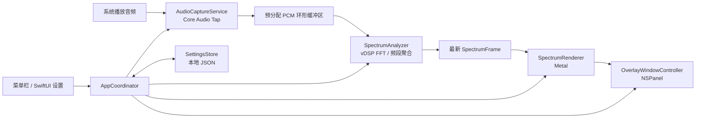

# macOS 常驻频谱工具：功能与架构设计

- 文档版本：1.0
- 日期：2026-09-11
- 状态：开发交接设计；用户已确认产品方向，本文具体默认参数作为首版实施基线，可在实测后调整。
- 项目性质：个人开发与学习项目。
- 系统基线：macOS 26.0+；用户报告当前使用 macOS 27，开发时记录具体系统、SDK、Xcode 与硬件版本。
- 交付范围：设计文档，不包含实现代码或已验证的运行效果。

## 1. 产品目标与边界

在屏幕顶部、底部或用户指定位置显示传统柱状音频频谱。频率从左到右由低到高排列；声音驱动柱条高度变化。用户正常工作时，频谱透明、置顶、鼠标穿透且不抢焦点；安静时自动淡出。

所有音频处理在本机内存中完成，不上传、不录制、不持久化原始音频。程序不进行网络请求，不依赖账户、服务器、在线素材或第三方虚拟声卡。

### 1.1 首版包含

- 获取全系统可捕获的播放音频并进行频谱分析。
- 一个无边框透明悬浮窗，支持拖动、调整宽高、顶部/底部吸附。
- 普通应用置顶、跨 Spaces 显示，以及目标系统上的全屏应用兼容验证。
- 16、32、64、128 条频谱柱，左低右高。
- 顶部向下、底部向上；自由位置保持最近一次方向，也可手动切换。
- 极简纯色、横向渐变、复古 LED 三种风格。
- 外观、灵敏度、回落速度、位置与尺寸的本地保存。
- 菜单栏控制、编辑/锁定模式、显示/隐藏、静音淡出、异常恢复。

### 1.2 首版不包含

- 多个频谱窗、多屏同时显示、每屏独立配置、自动跟随鼠标所在屏幕。
- 播放器、均衡器、音量控制、歌词、封面、歌曲识别、逐应用音源选择。
- 麦克风输入、音频录制/导出、网络更新、遥测、云同步、插件系统。
- 粒子、3D、波形等非传统频谱效果；全局快捷键、开机启动暂不作为必交项。
- App Store 发布、安装器、公证与商业发布流程。

单窗可以被拖到另一块显示器，这是基础窗口行为，不代表实现多屏管理。显示器断开时必须把窗口恢复到可见屏幕内，不能丢失控制入口。

## 2. 用户流程

### 2.1 首次启动

1. 菜单栏出现应用入口，不显示常驻 Dock 图标。
2. 展示简短说明：“仅在本机分析系统播放音频以显示频谱，不保存或上传声音。”
3. 用户点击“启用频谱”后启动系统音频授权流程。
4. 授权成功后，在主屏幕底部安全可见区域显示默认频谱，并短暂提示菜单栏可以调整位置。
5. 无声音时允许预览外观，但预览必须明确标识；正式运行不得使用假跳动冒充采集成功。
6. 拒绝或不可用时展示真实状态和操作指引，不循环请求权限。

### 2.2 日常运行

默认锁定，点击穿透到下层应用，不激活自身。播放声音后频谱出现，停止声音后回落并淡出。菜单栏随时可访问。

### 2.3 调整布局

从菜单栏选择“调整位置与尺寸”：退出鼠标穿透，显示边框、拖动区域与边缘手柄。拖动主体改变位置，拖动左右边缘改变宽度，拖动上下边缘改变高度。编辑时保持边框可见，即使无声音也不能丢失窗口。

结束调整后恢复穿透并保存配置。设置窗口可以正常取得键盘焦点；频谱窗在锁定时不得取得焦点。

### 2.4 菜单栏功能

- 当前状态：运行中 / 无声音 / 已隐藏 / 未授权 / 设备恢复中 / 错误。
- 显示或隐藏频谱。
- 调整位置与尺寸 / 完成调整。
- 放到底部 / 放到顶部 / 重置到当前可见屏幕。
- 设置、重新尝试音频采集、退出。

“隐藏”表示用户主动停用展示：停止采集和绘制。“静音淡出”只停高频绘制，保留必要采集以自动发现新声音。再次显示时重新建立采集并恢复最新状态。

## 3. 布局与外观规则

### 3.1 默认值及范围

以下为建议初值，验收以行为正确为先；性能及视觉调优后更新实际值。

| 参数 | 默认 | 范围/规则 |
|---|---|---|
| 位置 | 底部吸附 | 顶部、底部、自由 |
| 窗口宽度 | 可见区域宽度的 70% | 最小 240 pt，最大当前屏幕可见宽度 |
| 窗口高度 | 96 pt | 24–240 pt，受可见区域约束 |
| 边缘间距 | 8 pt | 0–120 pt，相对安全可见区域 |
| 柱条数量 | 64 | 16 / 32 / 64 / 128 |
| 柱间距 | 2 pt | 0–8 pt，布局不足时自动缩小有效间距 |
| 柱条透明度 | 70% | 10–100% |
| 圆角 | 2 pt | 0–8 pt，受柱宽和柱高约束 |
| 风格 | 极简纯色 | 纯色、渐变、LED |
| 频率范围 | 20 Hz–20 kHz | 首版固定，上限受 Nyquist 频率约束 |
| 灵敏度 | 0 dB | -12 至 +24 dB |
| 回落时间 | 180 ms | 80–500 ms |
| 活跃绘制帧率 | 60 FPS | 首版不默认追求 120 FPS |

宽度使用逻辑点，Metal drawable 使用像素。跨屏幕缩放因子变化必须更新 drawableSize。当条数较多、窗口过窄时，优先减少有效间距，必要时增加最小宽度；不得产生负柱宽或无提示地修改条数。

### 3.2 吸附与安全区域

- 使用目标 NSScreen 的 visibleFrame 作为初始安全区域，避开系统报告的菜单栏、Dock 占用区域。
- 拖动结束时距安全区域顶部/底部不超过 16 pt 则吸附；再次拖动可解除。
- 底部吸附自动向上生长，顶部自动向下生长；方向仍可手动覆盖。
- 自动隐藏的 Dock/菜单栏与全屏布局会改变遮挡情况；不承诺预测所有瞬时系统覆盖，也不进行持续避让动画。
- 所有恢复动作都要限制窗口在当前可见屏幕内，支持负屏幕坐标。

### 3.3 置顶边界

使用非激活 NSPanel、透明背景、无阴影、hidesOnDeactivate=false，并在锁定时启用 ignoresMouseEvents。

窗口层级及 collectionBehavior 由独立窗口策略负责。优先基于公开 API 的 canJoinAllSpaces、canJoinAllApplications、fullScreenAuxiliary 组合进行验证；遵守选项互斥关系和 SDK 可用性。不得仅设置 floating 就宣布完成全屏支持，也不得无验证地提升到最高层级遮挡系统界面。

目标是普通应用、跨 Spaces、全屏视频中保持可见且不抢焦点。锁屏、系统安全提示以及特殊独占全屏程序不在绝对覆盖承诺内。若全屏测试失败，这是核心兼容问题，必须明确反馈并记录可复现步骤，不能悄悄缩减范围。

## 4. 技术架构

采用原生单进程 macOS 应用：Swift、AppKit、SwiftUI、Core Audio Process Tap、Accelerate/vDSP、Metal/MetalKit。首版不引入 Electron、WebView、驱动或后端服务。

采用目标工具链支持的稳定 Swift 语言模式，部署目标为 macOS 26.0。优先公开 API，不为追求新版本而使用私有接口或尚未核实的 macOS 27 专属特性。硬件架构按实际开发机配置，交付时说明验证范围，不默认声称 Intel 兼容。

### 4.1 模块职责

| 模块 | 责任 | 不应承担 |
|---|---|---|
| AppCoordinator | 生命周期、用户意图、状态转换、协调恢复 | FFT 或 shader 细节 |
| AudioCaptureService | 授权结果处理、tap/aggregate/IO 生命周期、设备监听、PCM 输入 | UI、音频文件保存 |
| PCMBuffer | 有界、预分配的生产消费缓冲 | 无界排队或业务设置 |
| SpectrumAnalyzer | 声道功率合成、FFT、频段映射、归一化、时间平滑 | 窗口控制 |
| SpectrumFrameStore | 安全发布最新分析帧 | 积压旧帧 |
| SpectrumRenderer | Metal 资源、样式绘制、动画及暂停 | 获取系统权限 |
| OverlayWindowController | 置顶、穿透、拖动缩放、吸附与屏幕变化 | DSP |
| SettingsStore | schema 版本、校验、原子保存与恢复 | 保存音频数据 |
| MenuBarController / SettingsView | 用户入口、设置展示、错误说明 | 直接操作音频实时回调 |

模块以小型具体类型为主；仅在音频输入、分析输出等测试边界引入协议，避免插件框架与过度抽象。

### 4.2 数据与线程边界

- 音频实时回调：只读取必要格式信息并复制到预分配缓冲，禁止文件/网络 IO、日志刷屏、动态分配、等待锁、UI 操作和逐回调创建 Task。
- 单一 DSP 工作队列：消费 PCM，执行 FFT 与平滑；缓冲满时采用明确的有界丢帧策略，宁可丢旧数据也不累积延迟。并发实现必须确保没有覆盖读取中的数据。
- UI/窗口/设置状态在 MainActor 管理。
- 渲染通过有同步保证的双/三缓冲或受保护的最新帧快照读取结果；禁止读写同一可变数组产生数据竞争。
- SpectrumFrame 包含单调时间戳、序号、频段归一化能量数组、RMS dBFS、静音判断所需状态。
- CaptureFormat 包含采样率、通道数、样本类型和交错方式；格式变化清空缓冲并重建分析配置，不能把不同格式拼接。
- 设置更改通过不可变配置快照送至 DSP/渲染。条数变化时重新生成频段映射，避免旧数组越界。

## 5. 音频采集与频谱算法

### 5.1 采集策略

使用全局 Core Audio process tap 排除自身进程；创建私有 aggregate device 与 IO 回调。tap 设为不静音来源，保持原有扬声器/耳机播放，不修改用户默认输出设备。

Info.plist 提供 NSAudioCaptureUsageDescription。以实际 .app 包运行验证授权，不把权限名称简化成“麦克风权限”，不访问私有 TCC 数据库。最低权限和签名配置依据 SDK 与 Apple 文档核实，不猜测 entitlement。

监听默认输出设备、设备失效和格式变化；设备切换时在串行控制路径停止旧资源、清空缓存、建立新资源。start/stop 必须幂等，部分初始化失败也要按逆序释放已创建资源。恢复失败有限重试后进入可见错误状态，提供菜单栏手动重试。

全零样本不能单独证明权限失败，也不能证明采集正确。使用已知测试声音并结合创建结果、格式与回调状态诊断。受保护或系统不允许捕获的内容不保证可视化。

### 5.2 分析基线

1. 使用实际设备采样率，不为界面强制改变系统采样率。
2. 初始 FFT 长度 8192，hop 1024；按实测延迟调整，记录变更理由。
3. 去除 DC，施加 Hann 窗，分别计算左右声道频谱。
4. 按声道功率平均合成，避免左右反相时先混成 mono 导致抵消。多声道输入按有效声道功率平均，验证格式处理。
5. 对 20 Hz 至 min(20 kHz, Nyquist) 生成 N 个对数频段边界；将 FFT bin 按频段交叠权重聚合，使用带宽归一化后的功率。
6. 低频频段窄于 FFT bin 时采用明确的插值/重采样显示策略，避免空柱；注明相邻低频柱并非独立测量分辨率。不得用更多柱条宣称更高 FFT 分辨率。
7. 功率转换 dB 时加 epsilon，并做窗函数/FFT 尺度归一化；映射建议显示范围 -72 至 0 dBFS，再应用灵敏度并 clamp 至 0–1。
8. 上升时间初值 30 ms，回落 180 ms，采用基于实际 dt 的指数平滑，保证帧率变化时速度稳定。
9. 首版不启用自动增益，避免安静背景噪声被持续放大。整体 RMS 用于静音判定，不依赖柱高。

8192 点在 48 kHz 下覆盖约 171 ms，完整新窗口建立需要时间，不能承诺零延迟。低频分辨率与跟手感存在取舍，应以扫频定位、音乐观感和端到端测量确定最终参数。

## 6. 运行状态、静音与能耗

状态分成三个正交维度，避免将编辑、权限、静音混成单一枚举：

- CaptureState：idle / starting / running / recovering / permissionRequired / failed。
- PresentationMode：hidden / locked / editing。
- SignalState：active / quietWaiting / fading / silent。

初始静音参数：RMS 连续低于 -65 dBFS 1.5 秒后，在 350 ms 内淡出；高于 -60 dBFS 持续约 50 ms 恢复。采用滞回避免临界值闪烁，阈值在真实设备上校准。

- active：默认 60 FPS。
- silent：完成最终清屏后暂停 MTKView 连续绘制，保留采集和轻量 RMS 检测；可减少或暂停 FFT，有声时恢复。
- editing：边框保持可见；预览使用独立、明确标识的数据源。
- hidden：停止采集、DSP 和绘制，不自动因声音出现而恢复。
- 睡眠/锁屏：停止采集与绘制；唤醒/解锁后仅在用户意图仍为显示时恢复。
- 不因静音而销毁自动唤醒所依赖的全部音频输入。
- 不仅凭窗口 occlusionState 停采集，以免透明窗口或全屏切换误判后无法恢复。

## 7. 配置与本地数据

保存至 Application Support 下应用专属目录 settings.json，schemaVersion=1。最终 bundle identifier 和应用名称由开发初始化时确定，不能复用其他应用目录。

配置字段：placementMode、frame、screenHint、edgeInset、growthDirection、barCount、style、primaryColor、gradientColors、barOpacity、gap、cornerRadius、sensitivityDB、releaseMs。

frame 使用逻辑点；screenHint 仅用于尽力恢复，不构成多屏配置。启动时对照当前屏幕重定位和裁剪。编辑完成立即保存，连续设置更改防抖约 300 ms，采用临时文件加原子替换。

配置损坏时回退默认值并显示一次提示，不崩溃。忽略未知字段，校验非有限数值和越界值。权限状态从当前系统运行结果获得，不持久化为“永久已授权”。

仅保留本地必要诊断日志：错误码、生命周期、采样率和设备变化；不记录 PCM、歌曲信息或持续音频内容。日志限量，不输出每帧数据。

## 8. 开发顺序与交付要求

### 阶段 A：最高风险验证

- 建立原生 .app、菜单栏及单个 NSPanel。
- 验证系统授权和真实 tap 样本，原输出保持正常。
- 验证透明、穿透、不抢焦点、普通应用切换、Spaces 和全屏视频。
- 输出实测环境与结果；核心链路不通过时先定位，不扩展外观。

### 阶段 B：可用纵向切片

实现真实 64 条频谱、Metal 绘制、静音淡出与自动恢复，接通隐藏/显示、睡眠恢复与设备变化。

### 阶段 C：完整首版交互

加入拖动缩放、吸附、方向、条数、三种风格、设置保存与重置入口。

### 阶段 D：验收与性能

完成下述矩阵，记录未验证项和已知限制，交付源码、构建说明、测试报告及本地可运行 .app（工具链允许时）。构建失败或权限验证受阻必须明确说明，不能用预览截图代替真实音频证据。

开发 agent 应先读取所在仓库 AGENTS.md。新方法及关键逻辑使用符合 Swift 规范的文档注释；修改历史逻辑时标明原因、新行为和当前时间戳。保留无关工作区改动；不自动提交、推送、发布或部署。

## 9. 验收矩阵

| 编号 | 场景 | 通过标准 |
|---|---|---|
| F01 | 首次允许/拒绝授权 | 成功驱动真实频谱；拒绝有明确指引且不反复弹窗 |
| F02 | 本地单音 100 Hz / 1 kHz / 10 kHz | 主峰分别落在对应频段附近，允许窗泄漏及相邻柱影响 |
| F03 | 本地扫频与双音 | 峰位置由左向右移动，双音可以同时呈现 |
| F04 | 左右反相音频 | 有声不因 mono 抵消变成静音 |
| F05 | 播放/暂停/再次播放 | 自动出现、回落淡出、恢复，无虚假空闲跳动 |
| F06 | 正常工作与窗口切换 | 点击到达下层应用，键盘焦点不被抢占 |
| F07 | Spaces、全屏 Safari/视频、台前调度 | 记录各场景置顶与焦点结果，失败不得标为通过 |
| F08 | 编辑、缩放、吸附 | 操作顺畅、尺寸合法、方向正确，锁定后恢复穿透 |
| F09 | 条数和样式切换 | 16/32/64/128 均正常，无越界、负宽、闪退 |
| F10 | 隐藏、显示、退出 | 隐藏停止工作；显示恢复；退出释放音频资源 |
| F11 | 输出设备切换/断开 | 自动恢复或显示可操作错误，不改变默认输出 |
| F12 | 睡眠/唤醒/锁屏 | 恢复符合用户显示意图，无重复回调或资源泄漏 |
| F13 | 重启、损坏配置、屏幕变化 | 保存恢复正确，损坏有默认值，窗口不会永久丢失 |
| F14 | 断网运行与网络审计 | 全部核心功能可用，无应用主动网络请求 |
| F15 | macOS 26 与用户 macOS 27 | 分别记录系统 build；未具备实机/VM时标明未验证 |

### 9.1 自动化验证重点

- DSP：合成单音、双音、反相、零样本、不同采样率、有限输出、频段单调性和平滑 dt 行为。
- 状态：静音滞回、淡出后恢复、隐藏后不自动恢复、设备重建与 stop 幂等。
- 配置和几何：损坏数据回退、越界值、负屏幕坐标、不同缩放因子下窗口恢复。
- 人工验证：系统权限、全屏/Spaces、穿透与焦点、真实音频设备切换，不能仅用单元测试替代。

### 9.2 性能测量

在 Release 构建记录 Mac 型号、系统 build、采样率、屏幕刷新率、条数与样式，分别测量活跃 60 秒、静音 60 秒、隐藏 60 秒。

目标而非已验证承诺：默认 64 条稳定接近 60 FPS；稳态声音到视觉响应目标不超过 200 ms；CPU 平均争取低于单核 5%，常驻内存争取低于 100 MB。复杂样式单独测量。静音后必须停止连续 GPU 绘制；隐藏后音频 IO 必须停止；30 分钟运行不出现持续内存增长。

若目标未达成，提交测量值、瓶颈和取舍，不宣称“零开销”。使用 Instruments / Metal 工具验证，不只依赖肉眼或单次活动监视器截图。

## 10. 实施前必须核对的事项

1. 实际 Xcode/SDK 对目标系统和硬件的支持，以及公开窗口 API 的可用性与互斥规则。
2. Core Audio Tap 的签名、授权和设备配置；不能从文档推断当前机器已经成功。
3. 全屏置顶策略能否兼顾不抢焦点、不遮挡系统安全界面。
4. 真实音频格式、重建顺序和静音唤醒路径。

以上由开发 agent 实测解决，不需要重新讨论已确认的产品方向。若确需改变核心范围，应提交具体阻碍和备选方案供用户决定。

## 11. 参考资料与采用边界

以下支持技术选型；不代表本项目已完成实现或测试。

- [Apple：Capturing system audio with Core Audio taps](https://developer.apple.com/documentation/coreaudio/capturing-system-audio-with-core-audio-taps)：tap、aggregate device、系统音频授权及用途声明。
- [Apple：NSWindow.CollectionBehavior](https://developer.apple.com/documentation/appkit/nswindow/collectionbehavior-swift.struct)：Spaces、全屏和台前调度窗口行为。
- [Apple：MTKView.isPaused](https://developer.apple.com/documentation/metalkit/mtkview/ispaused)：控制连续绘制。
- [BeSpec](https://github.com/BeSpec-Dev/BeSpec)：传统频谱及穿透覆盖层的产品参考；其 macOS 虚拟声卡需求与联网功能不作为本项目方案。
- [rtaudio](https://github.com/ZephyrCodesStuff/rtaudio)：Core Audio/vDSP/Metal 实现思路参考；项目为 PoC 且使用 AGPL-3.0，不直接复制其代码作为默认实施方式。
- [AudioTee](https://github.com/makeusabrew/audiotee)：系统音频 tap 采集参考，不作为必须依赖。

实现优先使用 Apple SDK 和本项目自有代码；确需引入第三方源码时，先核对仓库实际许可证并记录来源。
