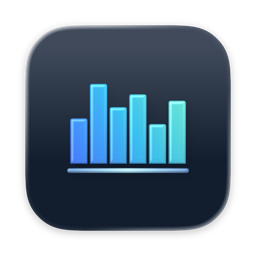
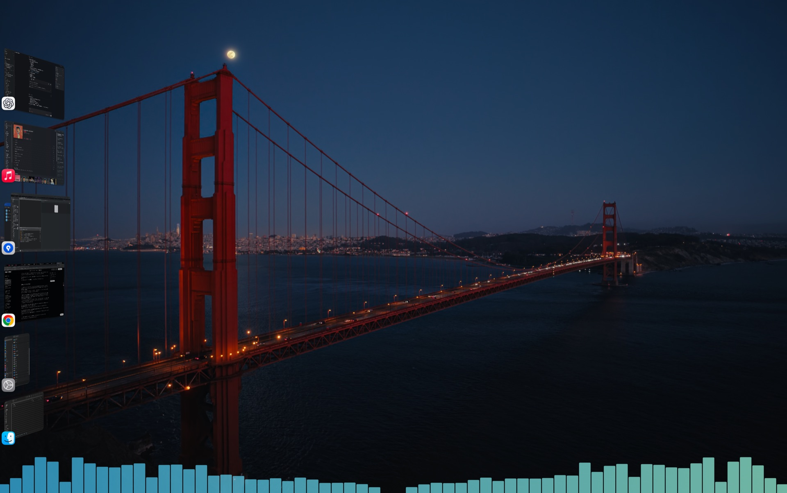
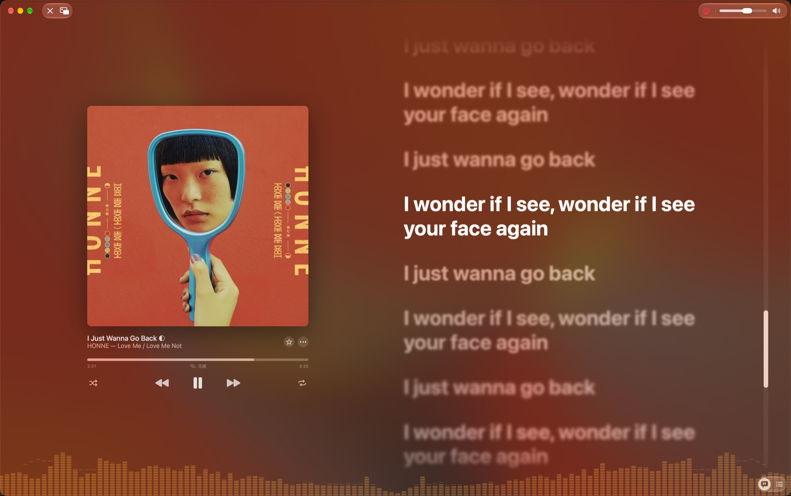

# Yinqi

[简体中文](README.md) | [English](README.en.md)

<p align="center">
  
</p>

<p align="center"><strong>Let sound settle on your desktop.</strong></p>
<p align="center">A lightweight, native macOS system-audio spectrum overlay.</p>

**Latest release: [1.1.1 · build 34](https://github.com/HTsummer0908/yinqi/releases/tag/v1.1.1)**

Yinqi analyzes the audio playing on your Mac and renders a customizable transparent spectrum along a desktop edge. Audio is processed locally and is never recorded, stored, or uploaded.

## Highlights

- Native, transparent macOS overlay that remains click-through during everyday use.
- Top, bottom, left, and right docking with dragging, resizing, and edge-fill shortcuts.
- Solid, gradient, and retro LED styles, plus eight editable and restorable theme presets.
- Merged, left, right, and mirrored frequency layouts with configurable bars, peaks, and animation.
- Core Animation and Metal renderers with automatic fade-out and drawing suspension after silence.
- Simplified and Traditional Chinese, English, French, German, Japanese, and Korean, plus settings import and export.

## Preview

| Desktop spectrum | Music playback |
| --- | --- |
|  |  |
| A transparent overlay along the desktop edge | Real-time response to system playback audio |

| Appearance customization | Layout and editing |
| --- | --- |
|  |  |
| Screenshot pending | Screenshot pending |

## Download and use

Download `Yinqi-1.1.1-arm64.zip` from [GitHub Releases](https://github.com/HTsummer0908/yinqi/releases/latest), extract it, and move `Yinqi.app` to Applications.

- Requirements: **macOS 26.0 or later** and **Apple Silicon (arm64)**.
- On first use, enable the spectrum in Settings and grant system-audio access when macOS asks.
- The current package is ad-hoc signed, not Developer ID signed, and not notarized by Apple. Gatekeeper may block it on another Mac.

## Build locally

A complete Xcode installation is required. Swift 6.4 in Swift 5 language mode with Xcode 27 Beta has been verified.

```sh
bash scripts/test.sh
bash scripts/build.sh
open build/Yinqi.app
```

If Xcode is not in a standard location, set `ICON_DEVELOPER_DIR` to its `Contents/Developer` directory. See the [development guide](docs/DEVELOPMENT.en.md) for architecture, localization, testing, and detailed build notes.

## More information

- [Development guide](docs/DEVELOPMENT.en.md) · [中文开发文档](docs/DEVELOPMENT.md)
- [1.1.1 release notes](docs/releases/1.1.1.md)
- [Test records](docs/testing) · [Performance records](docs/performance)
- [Mozilla Public License 2.0](LICENSE)
- [Licensing scope and third-party content](LICENSING.md)
