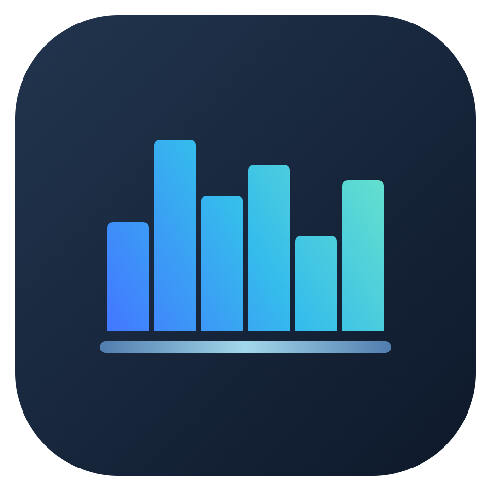
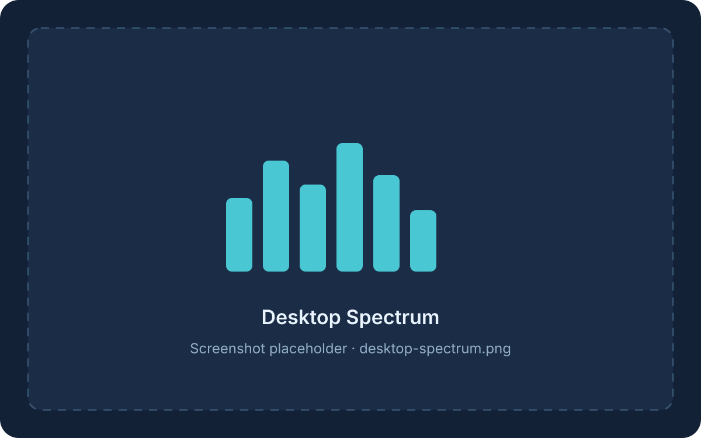
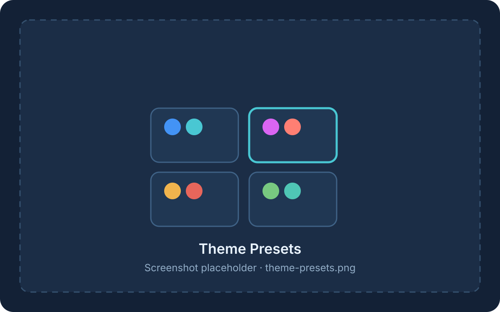
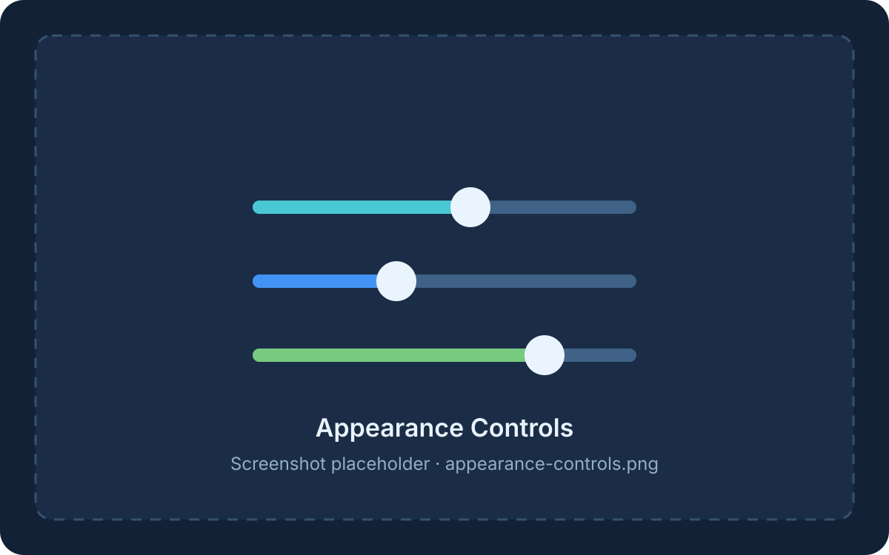
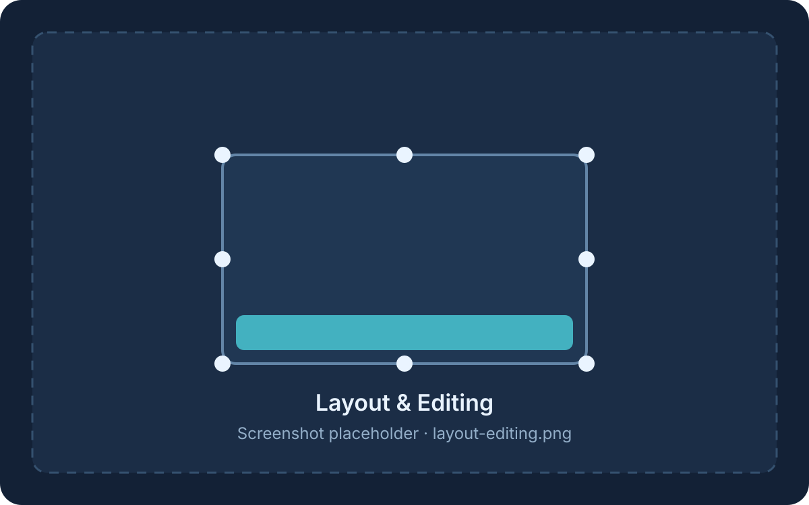

# Yinqi

[简体中文](README.md) | [English](README.en.md)

<p align="center">
  
</p>

Let sound settle on your desktop. Yinqi is a lightweight, native macOS system-audio spectrum overlay.

**Latest stable release: 1.0.1 · build 32**

The `main` branch also contains eight unreleased built-in theme presets with post-selection customization tracking. The 1.0.1 package in Releases does not include this feature yet.

## Features

- Real-time analysis of system playback audio, with merged, left, right, and mirrored frequency layouts.
- Transparent, click-through overlay with edge docking, fill layouts, dragging, and resizing.
- Solid, gradient, and retro LED styles; configurable bar count, spacing, corners, opacity, and peak markers.
- Eight built-in theme presets on `main`; presets remain editable and can be restored to their original values.
- Semantic controls by default, with precise numeric input available through Advanced Settings.
- 10/15/30/60/120 FPS presets, a custom 10–1000 FPS range, or the display's highest refresh rate; rendering fades and pauses after silence.
- Menu bar operation with optional Dock visibility; diagnostics run only when explicitly opened.
- JSON settings import and export for backup and transfer between Macs.
- Optional screenshot exclusion for both the spectrum overlay and editing toolbar.

## Preview

| Desktop spectrum | Built-in theme presets |
| --- | --- |
|  |  |
| Pending: `desktop-spectrum.png` | Pending: `theme-presets.png` |

| Appearance customization | Layout and editing |
| --- | --- |
|  |  |
| Pending: `appearance-controls.png` | Pending: `layout-editing.png` |

## Requirements and installation

Yinqi targets **macOS 26.0 or later**. The current package supports **Apple Silicon (arm64) only**.

The verified environment is an Apple M4 Mac running macOS 27.0 Beta (26A428). macOS 26 and Intel Macs have not been tested, and no Intel package is provided.

Download `Yinqi-1.0.1-arm64.zip` from Releases, extract it, and optionally move `Yinqi.app` to Applications before launching it.

The current package is **ad-hoc signed, not Developer ID signed, and not notarized by Apple**. Gatekeeper may block it on another Mac; cross-device installation has not yet been fully verified. A SHA-256 checksum confirms file integrity but does not replace developer signing.

On first launch, open Settings, enable the spectrum, and grant system-audio access when macOS asks. Closing Settings does not quit Yinqi; use the menu bar item to reopen it.

## Using Yinqi

- **General:** language, spectrum enablement, Dock visibility, screenshot exclusion, and four edge-fill shortcuts.
- **Spectrum:** channel mode, bar count, frequency layout, spacing, and frequency-range reduction.
- **Animation:** renderer, frame rate, volume sensitivity (−24 to +24 dB), and fall speed.
- **Appearance:** theme presets on `main`, bar style, colors, and peak markers. After selecting a preset, individual appearance settings remain editable.
- **Position:** docking, growth direction, edge margins, and editing mode. Editing supports dragging the overlay, its four edges, and four corners.
- **About:** Advanced Settings, project information, and settings import/export. Hover over an info icon for 800 ms to see its explanation.

Exported JSON contains a format version and portable settings. It does not contain the original display identifier, launch history, or spectrum enabled state. Import applies compatible appearance and behavior settings; changing the language or renderer requires a restart. Invalid files and failed saves leave the existing settings unchanged.

Settings are stored at `~/Library/Application Support/local.xinfei.yinqi/settings.json`. Older settings are migrated automatically without deleting the old file or overwriting an existing current settings file.

## Building from source

Building requires the Apple toolchain and a complete Xcode installation because the native layered app icon is compiled with Xcode tools. The verified toolchain is Swift 6.4 in Swift 5 language mode with Xcode 27 Beta and Icon Composer 2; other toolchain versions have not been tested.

From the repository root:

```sh
bash scripts/test.sh
bash scripts/build.sh
open build/Yinqi.app
```

The build script checks common Xcode locations. You can also select one explicitly. A complete build has been verified with Xcode 27 Beta installed on an external drive:

```sh
ICON_DEVELOPER_DIR="/Applications/Xcode.app/Contents/Developer" bash scripts/build.sh
```

The app is written against Core Audio, Accelerate, AppKit, SwiftUI, MetalKit, and a C11 atomic queue. It has no third-party runtime dependencies or SwiftPM downloads.

Native-window and Metal pixel regression checks require a graphical session and briefly show test windows:

```sh
bash scripts/test-rendering.sh
bash scripts/test-localization.sh
bash scripts/test-termination.sh
```

## Languages and app name

General → Language supports System Default, Simplified Chinese, Traditional Chinese (Hong Kong and Macau), Traditional Chinese (Taiwan), English, French, German, Japanese, and Korean. A new or migrated configuration follows the first supported language in the macOS preference list and falls back to English.

Changing or importing a language requires a restart through the existing Restart Now / Restart Later flow. The app does not change the system language.

The installed bundle remains `Yinqi.app`. Its localized display name is “音栖” or “音棲” in Chinese and “Yinqi” in other languages. Finder follows macOS localization and caching rules, so changing Yinqi's in-app language may not immediately change its Finder name.

Translations live in `Resources/<language>.lproj/Localizable.strings`; localized names and permission text live in `InfoPlist.strings`. Keep `%@` placeholders intact when editing translations. Run `bash scripts/test-localization.sh` after localization changes.

## Privacy and compatibility scope

Audio is analyzed locally in real time. Yinqi does not record, store, or upload audio, send telemetry, or automatically check for updates. Network access occurs only when the user opens a GitHub link.

Screenshot exclusion uses the AppKit window-sharing property and has been confirmed in the current test environment. Screen-recording exclusion is not guaranteed. Frame rate remains subject to display capabilities and macOS scheduling.

See the [1.0.1 release notes](docs/releases/1.0.1.md), [localization test report](docs/testing/RESULTS-1.0.1-languages.md), and historical [architecture document](2026-09-11-macos-spectrum-functional-architecture.md) for more detail.

## Development and project status

- Developer: [HTsummer0908](https://github.com/HTsummer0908)
- Repository: [HTsummer0908/yinqi](https://github.com/HTsummer0908/yinqi)

Core source directories are `Sources/Realtime` for the real-time queue and `Sources/Yinqi` for capture, analysis, rendering, and UI. Icon sources are in `Resources/Branding`.

The screenshot-exclusion behavior references the public AppKit window-sharing approach used by [LyricsX](https://github.com/MxIris-LyricsX-Project/LyricsX).

## License

Yinqi is licensed under the [Mozilla Public License 2.0](LICENSE). You may use, modify, distribute, and use the project commercially. If you modify existing MPL-covered files and distribute the result, those modified files must remain available in source form under MPL-2.0. Independent files or modules combined with Yinqi are not automatically required to use MPL.

This summary is provided for convenience. The [license text](LICENSE) controls the actual rights and obligations.
